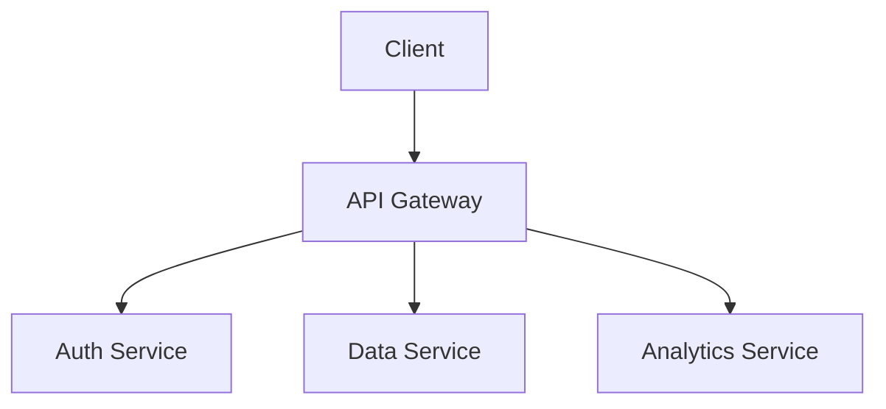

# Annual Report 2026

Q4 Financial Summary

---

## Executive Summary

The company has achieved record growth this year.

Key highlights:
- Revenue increased by 45%
- Customer base grew to 10,000+
- Three new products launched
- Expanded to 12 new markets

NOTE: Emphasize the revenue growth number.

---

## Financial Performance

### Revenue Breakdown

| Quarter | Revenue | Growth |
|---------|---------|--------|
| Q1 | $2.1M | +12% |
| Q2 | $2.8M | +33% |
| Q3 | $3.4M | +21% |
| Q4 | $4.2M | +24% |

### Cost Analysis

```python
costs = {
    'engineering': 1_200_000,
    'marketing': 800_000,
    'operations': 600_000,
    'administration': 400_000,
}
total = sum(costs.values())
print(f'Total costs: ${total:,}')
```

---

## Product Comparison

| Feature | Product A | Product B | Product C |
|---------|-----------|-----------|-----------|
| Speed | Fast | Medium | Slow |
| Price | $99 | $149 | $199 |
| Support | 24/7 | Business | Premium |
| Rating | 4.5 | 4.2 | 4.8 |

NOTE: Product C leads on features but Product A leads on value.

---

## Architecture

The system uses a microservices architecture.



---

## Next Steps

1. Finalize Q1 budget by January 15
2. Launch version 2.0 in February
3. Hire 20 new engineers
4. Expand to APAC region

Thank you!

NOTE: Q1 budget deadline is critical.
